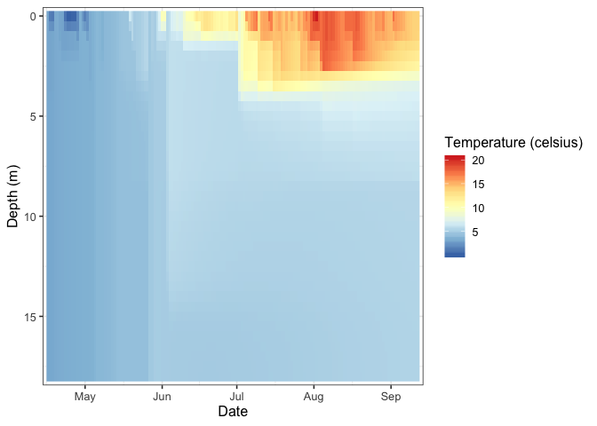

<!-- README.md is generated from README.Rmd. Please edit that file -->

# GLM3r

| Linux                                                                                                     | Windows                                                                                                                                    |
| --------------------------------------------------------------------------------------------------------- | ------------------------------------------------------------------------------------------------------------------------------------------ |
| [](https://travis-ci.org/GLEON/GLM3r) | [](https://ci.appveyor.com/project/jread-usgs/GLM3r) |

[](https://zenodo.org/badge/latestdoi/23404/GLEON/GLM3r)

R package for basic
[GLM](http://aed.see.uwa.edu.au/research/models/GLM/) model running.
`GLM3r` is designed to hold the most current version of the General Lake
Model (GLM) for linux, mac, and windows platforms. This package does not
contain the source code for the model, only the executable, and
functions for handling the various platform requirements for running the
model. Also, use `glm_version()` to figure out what version of GLM you
are running.

## Installation

You can install GLM3r from Github with:

``` r
# install.packages("devtools")
devtools::install_github("GLEON/GLM3r")
```

## Usage

### Run

``` r
library(GLM3r)

sim_folder <- system.file('extdata', package = 'GLM3r')

run_glm(sim_folder)
```

``` 

Reading config from glm3.nml
No WQ config
No diffuser data, setting default values
WARNING: Initial profiles problem - epected 0 wd_init_vals entries but got 30
       ------------------------------------------------
       |  General Lake Model (GLM)   Version 2.2.0rc5    |
       ------------------------------------------------
nDays 165825900 timestep 3600.000000
Maximum lake depth is 49.000000
Simulation begins...
Running day  2451636, 0.66% of days complete
Running day  2451637, 1.32% of days complete
---
Running day  2451785, 99.34% of days complete
Running day  2451786, 100.00% of days complete
Wall clock runtime 11 seconds : 00:00:11 [hh:mm:ss]

------------------------------------------------
              Run Complete
```

### Visualize

``` r
library(glmtools)

out_file <- file.path(sim_folder, 'output/output.nc')
plot_var(nc_file = out_file, var_name = 'temp')
```

<!-- -->
